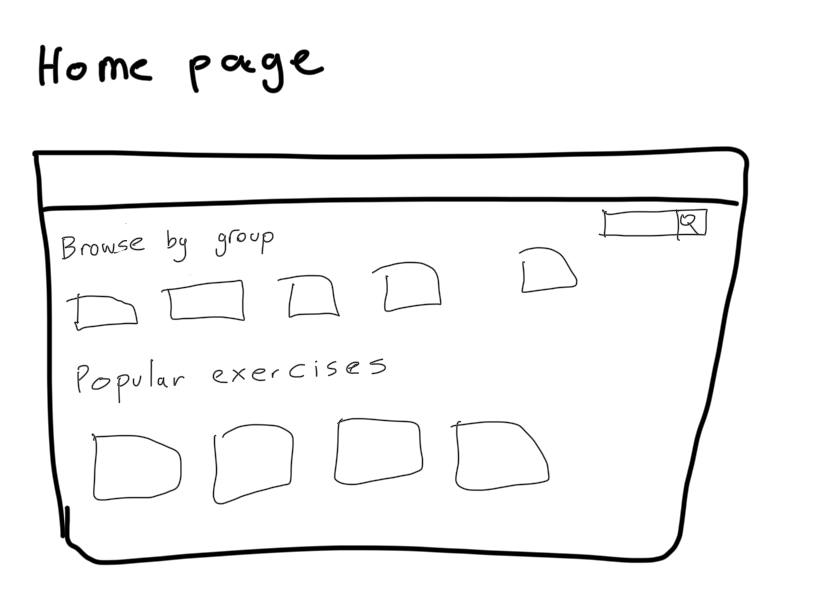
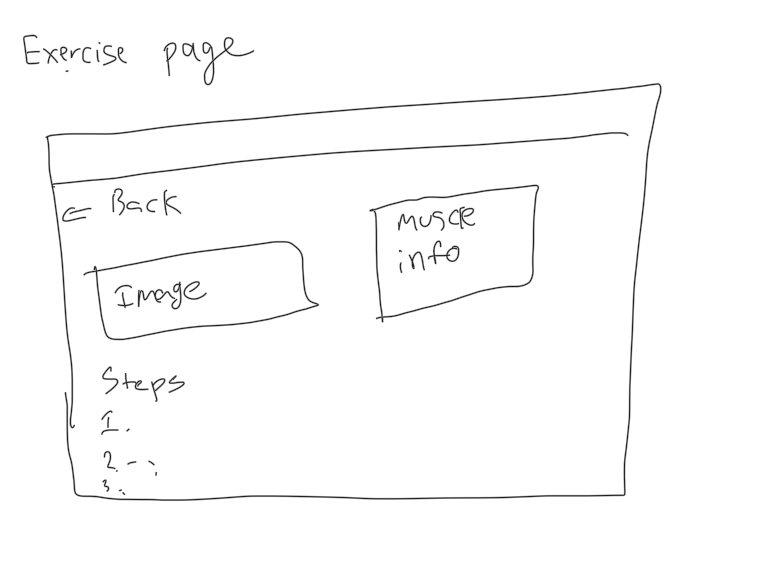
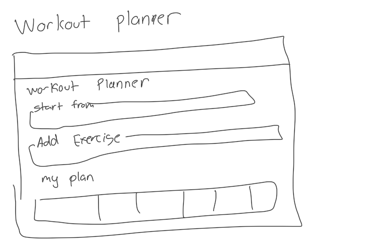

# CSCI 3230U - Final Project

<!-- add team names -->
### Team Members:
Thanush Dinesh
Cole Becker
Nabeel Khan
Kharintirasakar

#### Topic:
We will be making a web application that allows users to view different exercises and their details. The application will provide a list of exercises, and users can click on an exercise to view more information about it, such as the muscle groups it targets, equipment needed, instructions and visual images of it. This is for new gym beginners that are unsure what exercise hits what muscle and to give detailed images and instructions on how to perform it. Along with it we will have the option to filter the exercises based on muscle groups, equipment. Also we will have the ability to make a custom workout plan by saying what muscle groups you want to target and the application will generate a workout plan for you.

#### Data Source:

**API:** ExerciseDB API (Free V1)
**Base URL:** `https://oss.exercisedb.dev/api/v1`


The free tier has 1,500+ exercises, each with an animated GIF's and step-by-step instructions on how to perform the exercise.
### Endpoints we'll use

| Endpoint | Used for |
| --- | --- |
| `GET /exercises` | List page, filtering, and generating workout plans |
| `GET /exercises/{exerciseId}` | Single exercise detail page |

The sample response is shown below.

```json
{
  "exerciseId": "EIeI8Vf",
  "name": "barbell bench press",
  "gifUrl": "https://static.exercisedb.dev/media/EIeI8Vf.gif",
  "targetMuscles": ["pectorals"],
  "bodyParts": ["chest"],
  "equipments": ["barbell"],
  "secondaryMuscles": ["triceps", "shoulders"],
  "instructions": [
    "Step:1 Lie flat on a bench with your feet flat on the ground...",
    "Step:2 Grasp the barbell with an overhand grip...",
    "Step:3 Lift the barbell off the rack..."
  ]
}
```

We will be using the following fields from the API response in our application:
| Field | Where it's used |
| --- | --- |
| `exerciseId` | Linking from the list page to the detail page |
| `name` | Exercise title on list cards and the detail page |
| `gifUrl` | Visual demonstration on the detail page and card thumbnails |
| `targetMuscles` | Detail page, muscle group filter, workout plan generator |
| `secondaryMuscles` | Detail page ("also works") |
| `bodyParts` | Filtering and grouping exercises for workout plans |
| `equipments` | Detail page and equipment filter |
| `instructions` | Step-by-step list on the detail page |

#### Comparators

| App | Site | What it does |
| --- | --- | --- |
| MuscleWiki | https://musclewiki.com/ | An interactive site where you click a muscle group to see videos of exercises that target it. Its core library is free, but many features are behind a paid premium subscription. |
| ExRx.net | https://exrx.net/ | A reference site with over 2,100 exercises organized by muscle group and the equipment you have available. |
| Muscle & Strength | https://www.muscleandstrength.com/ | A reference site where you can browse exercises and instructions for each muscle group, along with pre written workout programs. |

Our site is completely free, with no subscriptions or paid features. On top of letting users target the muscles they want, it also tells them which parts of their body they are neglecting, based on the workouts it creates for them. Users can also pick a physique or fitness goal, such as calisthenics, a bigger back, a bigger chest, or a pull-up target, and follow a plan built to reach it. None of these sites combines a workout builder with this kind of goal-based, personalized guidance.

#### Scaled Feature Plan:

##### Baseline features (required for every group)

These are the shared foundation of the app. Each one has an owner.

| Baseline feature | How it appears in our app | Owner |
| --- | --- | --- |
| React + Vite setup, app shell (header, nav, layout) | Shared layout used by every page | Thanush |
| Multiple routes with client-side routing | `/`, `/exercises`, `/exercises/:id`, `/planner`, `/recommended` | Thanush |
| Collection loaded from a web service | Exercises fetched from ExerciseDB and mapped to our own shape at the boundary | Nabeel |
| Mock data for early development | In-repo JSON of sample exercises used before the live API (M2) | Cole |
| Cards / list view | Exercise cards showing name, GIF, target muscle and equipment | Cole |
| Loading, error and empty states | Spinner while loading, a message if the API fails, and "No exercises found" for empty results | Kharintirasakar |
| Search, filter and sort | Search by name, filter by muscle group and equipment, sort A–Z / Z–A or by muscle group | Cole |
| Detail view with URL params | `/exercises/:id` uses `exerciseId` to show target and secondary muscles, equipment, GIF and step-by-step instructions | Cole |
| Persisted user state (localStorage) | Favourite exercises saved with a custom hook + `localStorage` | Nabeel |
| Controlled form | Workout planner form (exercise, sets, time) controlled by React state | Kharintirasakar |
| Accessible and responsive | Semantic HTML, labelled controls, alt text, keyboard navigation, AA contrast, layouts that work on phones | Everyone |
| Automated tests | Tests for filter/sort logic and key components | Everyone |
| Deployed to a public URL | Hosted on Netlify | Cole |

##### Vertical slices

Kharintirasakar: Will be responsible for making the workout planner, this website will use drop down menus and tables to list activities planned as well as having prebuilt workouts for one to use. After that once JavaScript is used results will be displayed using calculations for calories gained and lost (a stretch goal, since the API does not provide calorie data, so this would be our own estimate). Javascript may be used if time permits to make a graph about this. Furthermore if time permits there may be recommended workouts based on which section is believed to be the most missing. This will overall be where the user plans their workouts and the time needed to complete them. Buttons will also be added to ensure that the selected components will be added as well as an undo button. Currently the planned route will be `/planner`.

Cole: Will be responsible for making the list of workouts that are provided in the website, with JavaScript these will be used to help make the workout planner suggestions in the dropdown menu. They also serve to inform the user of the best workouts to improve on in desired areas. This will also include a search bar to find which workouts to do as well as detailed descriptions about each workout. Images will be provided to help the user better understand the workouts. A learn more button may possibly be included for each section so that when pressed a pop up will be shown to display more detailed information as well as recommended times for the workout. Currently the planned route will be `/exercises`.

Thanush: Will be responsible for making the homepage. This will include a much more broad and general list of workouts as well as a search bar for muscle groups. A dropdown menu will also help search for the website. It will also have a search bar for muscle groups that are benefited by the workout. This will also have quick links to famous workout routines that will be used by the website planner. General UI features and decorations will mainly be in the home page where it can navigate and help the user better understand the website as well as its functionality. Additionally if time permits, JavaScript may be used to allow the user to click the exercise and go to listing to get the more detailed version. Currently the planned route will be `/`.

Nabeel: Will be responsible for making the recommended workout page. This will be used by the workout planner for builds to suggest. It will include inputs from the user for their main focus and give workouts as well as a paragraph as to why the workout is the best for them. It will also use previous workout pages to see how to adapt this to ensure optimal performance by the user. This can include a generated goal using a button to apply this to the workout planner. There will also be feedback in this part using the data we had. Currently the planned route will be `/recommended`.

All vertical slices will use the same API: **Base URL:** `https://oss.exercisedb.dev/api/v1` 

#### Wireframes:

**Home Page**



**Exercise Page**



**Workout Planner**


